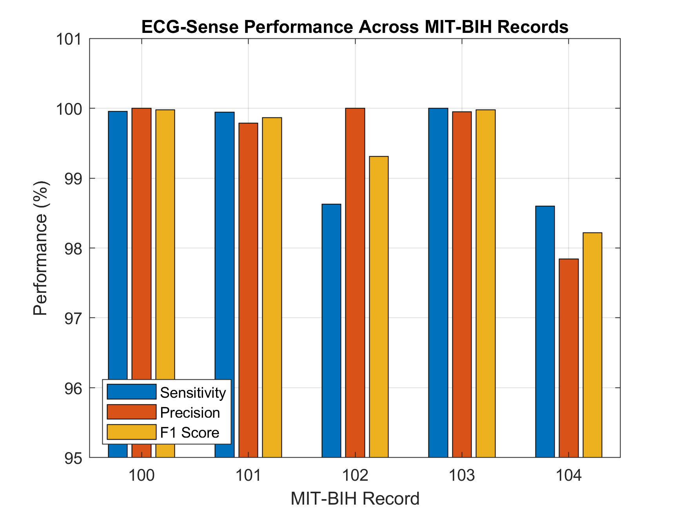
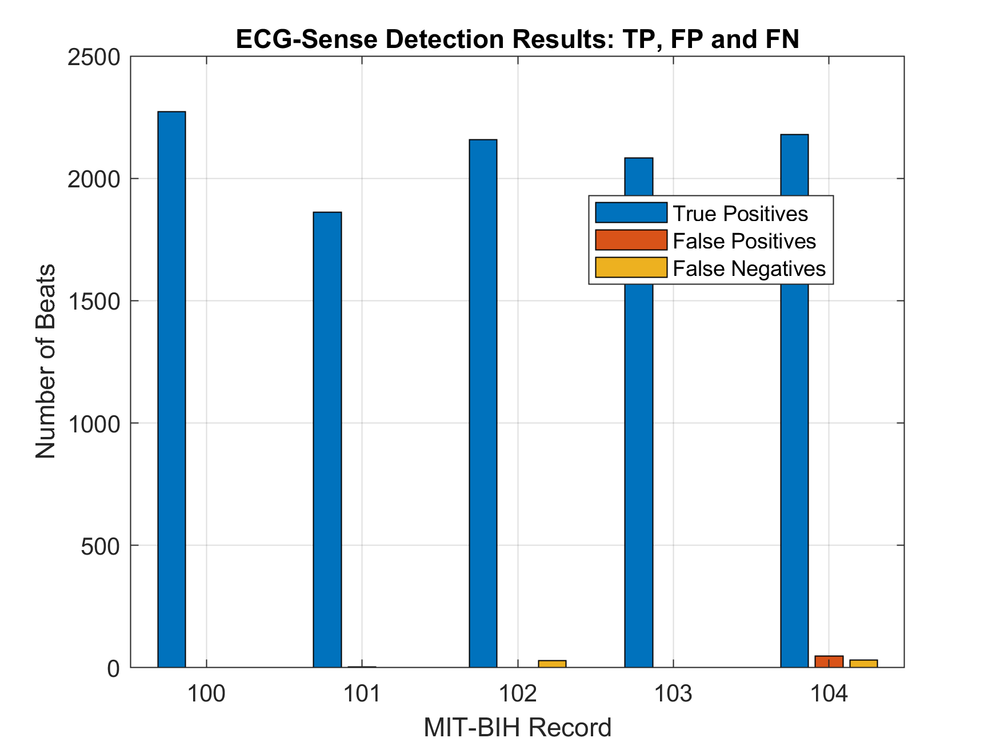
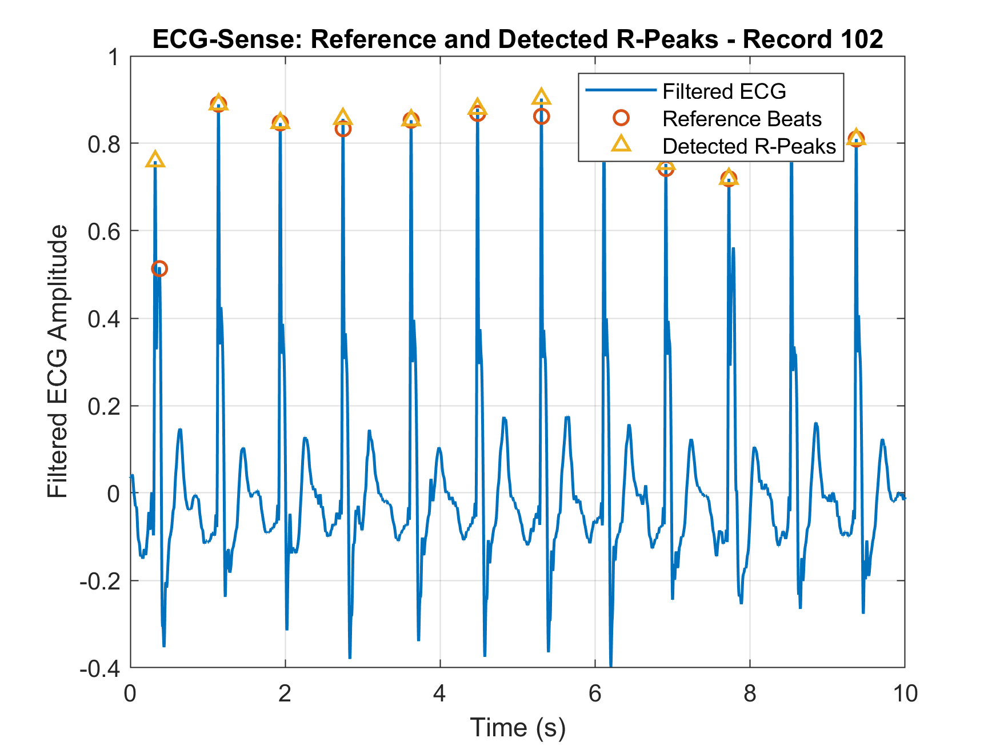
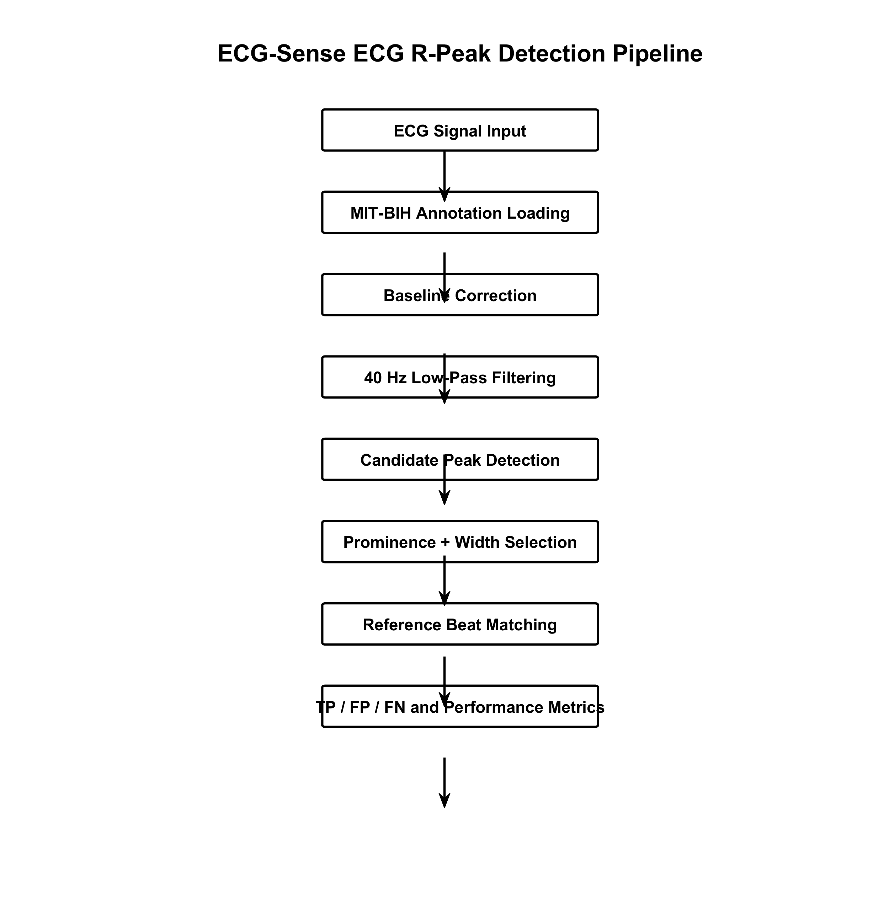

# ECG-Sense — High-Performance ECG R-Peak Detection Pipeline

ECG-Sense is a MATLAB-based ECG R-peak detection and evaluation pipeline using digital signal-processing techniques and the MIT-BIH Arrhythmia Database.


## Overview

ECG-Sense processes ECG signals through baseline correction, low-pass filtering, candidate peak detection, morphological peak selection, and reference-beat matching.

The final pipeline was evaluated on MIT-BIH records 100, 101, 102, 103, and 104.

## Key Highlights

- Baseline-wander correction
- Fourth-order Butterworth low-pass filtering
- Candidate R-peak detection using MATLAB findpeaks
- Morphological width-based peak selection
- One-to-one reference matching
- 100 ms matching tolerance
- Sensitivity, precision, and F1 evaluation
- CSV, Excel, MAT, and visualization outputs

## Processing Pipeline

```text
ECG Signal
    ↓
Baseline Correction
    ↓
40 Hz Butterworth Low-Pass Filter
    ↓
Candidate Peak Detection
    ↓
Prominence + Width Selection
    ↓
Detected R-Peaks
    ↓
Reference Beat Matching
    ↓
TP / FP / FN
    ↓
Sensitivity / Precision / F1
```

## Signal Processing

### Baseline Correction

A 180-sample moving-average baseline is estimated and subtracted from the ECG signal.

```matlab
baseline = movmean(sig,180);
ecgCorrected = sig - baseline;
```

### Low-Pass Filtering

A fourth-order Butterworth low-pass filter with a 40 Hz cutoff is applied using zero-phase filtering.

```matlab
[b,a] = butter(4,40/(Fs/2),'low');
ecgFiltered = filtfilt(b,a,ecgCorrected);
```

## Final Detector Parameters

| Parameter | Value |
|---|---:|
| Sampling frequency | 360 Hz |
| Minimum peak distance | 0.40 s |
| Minimum peak prominence | 0.15 |
| Width threshold | 35 samples |
| Matching tolerance | 0.10 s |

## Reference Beat Types

| Symbol | Meaning |
|---|---|
| N | Normal beat |
| A | Atrial premature beat |
| V | Ventricular premature beat |
| F | Fusion beat |
| / | Paced beat |
| f | Fusion of paced and normal beat |

## Evaluation Metrics

### Sensitivity

```text
Sensitivity = TP / (TP + FN)
```

### Precision

```text
Precision = TP / (TP + FP)
```

### F1 Score

```text
F1 = 2 × Precision × Sensitivity / (Precision + Sensitivity)
```

## Final Results

| Record | Reference | Detected | TP | FP | FN | Sensitivity | Precision | F1 |
|---|---:|---:|---:|---:|---:|---:|---:|---:|
| 100 | 2273 | 2272 | 2272 | 0 | 1 | 99.96% | 100.00% | 99.98% |
| 101 | 1863 | 1866 | 1862 | 4 | 1 | 99.95% | 99.79% | 99.87% |
| 102 | 2187 | 2157 | 2157 | 0 | 30 | 98.63% | 100.00% | 99.31% |
| 103 | 2084 | 2085 | 2084 | 1 | 0 | 100.00% | 99.95% | 99.98% |
| 104 | 2211 | 2228 | 2180 | 48 | 31 | 98.60% | 97.85% | 98.22% |

### Overall Performance

| Metric | Result |
|---|---:|
| Total TP | 10,555 |
| Total FP | 53 |
| Total FN | 63 |
| Sensitivity | **99.41%** |
| Precision | **99.50%** |
| F1 Score | **99.45%** |

## Project Structure

```text
ECG-Sense/
├── analysis/
├── app/
├── data/
│   └── mitdb/
├── detection/
├── docs/
│   └── ECG_Sense_Methodology.md
├── figures/
│   ├── ECG_Sense_Algorithm_Flowchart.png
│   ├── ECG_Sense_Final_Performance.png
│   ├── ECG_Sense_Record102_10s.png
│   └── ECG_Sense_TP_FP_FN.png
├── filters/
├── results/
│   ├── ECG_Sense_Final_Results.mat
│   ├── ECG_Sense_Final_Results.csv
│   ├── ECG_Sense_Final_Results.xlsx
│   └── ECG_Sense_Final_Results_Table.mat
└── src/
    ├── evaluateECGRecord.m
    └── evaluateMultipleECGRecords.m
```

## Reproducibility

Final numerical results are preserved in the results directory in MAT, CSV, and Excel formats.

The methodology is documented in docs/ECG_Sense_Methodology.md.

## Visual Results









## Limitations

- Evaluation currently covers five MIT-BIH records.
- The system uses classical signal-processing methods rather than a learned neural model.
- The reported performance is not clinical validation.
- Further testing across larger and more diverse datasets is required before any real-world clinical deployment.

## Future Improvements

- Evaluate the complete MIT-BIH Arrhythmia Database.
- Add adaptive patient-specific thresholding.
- Incorporate QRS slope and energy features.
- Test robustness against motion and muscle artefacts.
- Compare against established ECG detection algorithms.
- Investigate real-time embedded implementation.

## Conclusion

ECG-Sense achieved an overall sensitivity of 99.41%, precision of 99.50%, and F1 score of 99.45% across the evaluated MIT-BIH records.

The project emphasizes reproducible preprocessing, transparent detection logic, quantitative evaluation, and documented experimental results.

## Dataset

This project uses the MIT-BIH Arrhythmia Database distributed through PhysioNet.

## Responsible Use

ECG-Sense is intended for education and research. It is not a medical device and must not be used as a substitute for professional medical diagnosis.

---

ECG-Sense | MATLAB | Digital Signal Processing | ECG R-Peak Detection
